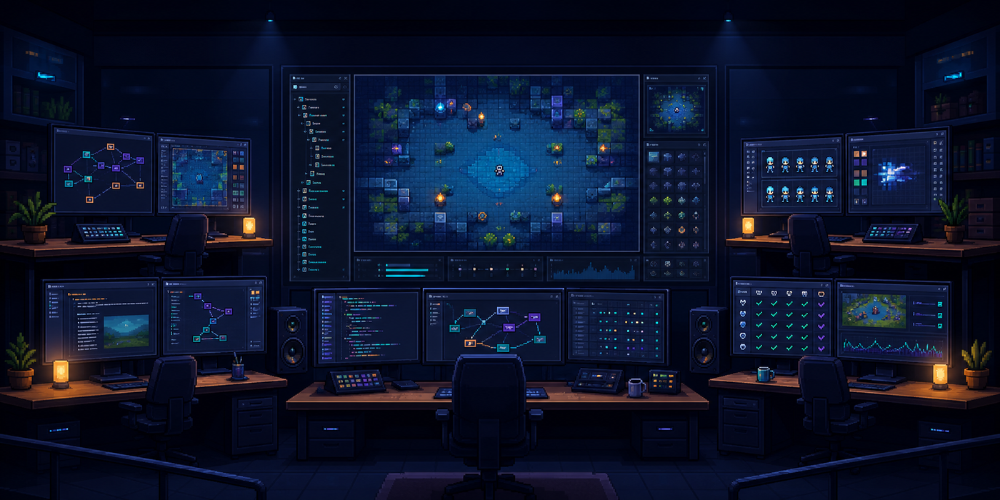
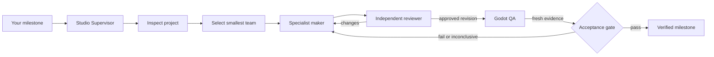
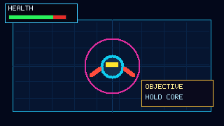
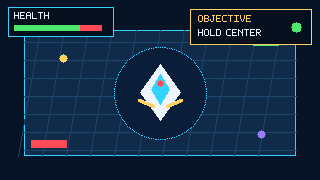

<p align="center">
  
</p>

<h1 align="center">Godot Gamestudio</h1>

<p align="center"><strong>Give your coding agent a game studio, not a longer prompt.</strong></p>

<p align="center">
  Build Godot milestones with automatically selected specialists, independent reviewers,<br>
  runtime QA, resumable state, and evidence-gated approval.
</p>

<p align="center">
  <a href="https://github.com/schmoenraad/godot-gamestudio/actions/workflows/ci.yml"></a>
  <a href="https://github.com/schmoenraad/godot-gamestudio/releases/latest"></a>
  <a href="LICENSE"></a>
  
  
</p>

<p align="center">
  <a href="#install">Install</a> ·
  <a href="#see-the-loop">See the loop</a> ·
  <a href="#pilot-evidence">Pilot evidence</a> ·
  <a href="https://github.com/schmoenraad/godot-gamestudio/discussions">Discussions</a> ·
  <a href="https://github.com/schmoenraad/godot-gamestudio/issues/new?template=benchmark_submission.yml">Submit a benchmark</a>
</p>

## Why It Exists

Coding agents are good at making Godot changes. They are less reliable at knowing whether those changes actually work.

Godot Gamestudio adds a production loop around the agent:

- A **Supervisor** turns your request into one measurable milestone.
- The smallest useful set of **specialists** owns non-overlapping deliverables.
- An independent **reviewer** challenges each artifact without seeing maker reasoning.
- **QA** runs Godot and records fresh project-relative evidence.
- The milestone cannot pass with stale screenshots, missing files, inconclusive checks, or approvals for an older revision.

It works with ordinary Godot commands and optionally uses GodotIQ when available.

## Try It

```text
$godot-gamestudio build Create a playable top-down quest with one NPC,
one branching choice, a small tilemap, and a verified completion state.
```

The studio can select Narrative Designer, World Builder, Gameplay Engineer, their independent reviewers, a Creative Director for cross-discipline coherence, and QA. Simple requests use a smaller team.

## See The Loop



| Studio capability | What it prevents |
| --- | --- |
| Automatic role routing | Invoking every agent for every task |
| Normalized path ownership | Concurrent agents editing the same scene or script |
| Revision-bound reviews | Reusing approval after the artifact changed |
| Hashed QA evidence | Passing with missing, stale, or altered screenshots and logs |
| Resumable `studio.json` | Replaying completed work in the next session |
| Two-round revision limit | Endless reviewer-driven scope expansion |

## Install

### Codex

```bash
codex plugin marketplace add schmoenraad/godot-gamestudio
codex plugin add godot-gamestudio@godot-gamestudio
```

### Claude Code

```text
/plugin marketplace add schmoenraad/godot-gamestudio
/plugin install godot-gamestudio@godot-gamestudio
```

### Gemini CLI

```bash
gemini extensions install https://github.com/schmoenraad/godot-gamestudio
```

### Kimi Code CLI

```text
/plugins install https://github.com/schmoenraad/godot-gamestudio
/reload
```

Then invoke `godot-gamestudio` using the syntax supported by your harness. Claude skills are namespaced, for example `/godot-gamestudio:godot-gamestudio build ...`.

## Studio Modes

| Mode | Use it for |
| --- | --- |
| `build` | Full maker, reviewer, revision, QA, and acceptance loop |
| `quick` | One maker, one reviewer, and targeted verification |
| `plan` | Team selection and milestone design without implementation |
| `review` | Independent multidisciplinary review of existing work |
| `status` | Current milestone, evidence, risks, and blockers |

## Included Roles

**Makers:** Game Designer, Narrative Designer, World Builder, Sprite Studio, Gameplay Engineer, Technical Artist, UI/UX Designer, and Audio Designer.

**Reviewers:** Systems Critic, Narrative Editor, Level Design Reviewer, Animation Reviewer, Code Reviewer, Art Consistency Reviewer, UI Accessibility Reviewer, and Performance Reviewer.

**Coordination and proof:** Studio Supervisor, Creative Director, and QA Playtester.

## Pilot Evidence

The first executable pilot tested clean-workspace routing and a visual Godot creation fixture. It is an engineering pilot with `n=1`, not a statistically significant quality claim.

| Test | No-skill baseline | Godot Gamestudio |
| --- | ---: | ---: |
| Codex exact team-contract routing | 0/3 | **3/3** |
| Gemini exact team-contract routing | 0/3 | **3/3** |
| Codex visual fixture | Pass | Pass |
| Gemini visual fixture | Claimed pass, external grader rejected it | Claimed pass, external grader rejected it |

The important result is the last row: both Gemini runs claimed successful screenshots, but the external grader deleted the expected image, reran Godot, and found no fresh PNG. Gamestudio records that as a failure instead of accepting a confident completion message.

<table>
  <tr>
    <th>No-skill Codex fixture</th>
    <th>Godot Gamestudio fixture</th>
  </tr>
  <tr>
    <td></td>
    <td></td>
  </tr>
</table>

Read the [full pilot report](docs/benchmark-results/2026-06-14-pilot.md), its [machine-readable results](docs/benchmark-results/2026-06-14-pilot.json), and the [evaluation plan](docs/benchmarks.md).

## Help Make It Better

This project should improve through public evidence, not leaderboard theater.

- **Star the repository** if you want a reliable open Godot agent workflow to keep growing.
- [Submit a reproducible benchmark](https://github.com/schmoenraad/godot-gamestudio/issues/new?template=benchmark_submission.yml) from a 2D or 3D Godot project.
- [Open a discussion](https://github.com/schmoenraad/godot-gamestudio/discussions) with a workflow, role, or Pro automation idea.
- Pick up a [`good first issue`](https://github.com/schmoenraad/godot-gamestudio/labels/good%20first%20issue) or read [CONTRIBUTING.md](CONTRIBUTING.md).

The complete correctness loop remains open source. A future Pro edition may automate visual regression, videos, CI reports, dashboards, and supported integrations without withholding the Community safety gates. See [product direction](docs/product.md).

## Honest Limitations

- The published benchmark is still small and does not prove universal model-quality gains.
- Agent dispatch capabilities differ by harness; Kimi maps roles onto its built-in subagents.
- Visual QA still depends on available rendering and capture tools. Missing verification is `inconclusive`, never a pass.
- GodotIQ is optional and not bundled. Community operation works without MCP integrations.

## Development

```bash
python3 scripts/generate_adapters.py --check
python3 -m unittest discover -s tests -v
python3 scripts/validate_repo.py
python3 scripts/build_release.py
```

Godot Gamestudio is Apache-2.0 licensed. The repository consolidates compatible lessons and workflows from several public Godot and agent projects into one supervised toolkit; [SOURCES.md](SOURCES.md) and [NOTICE](NOTICE) record what was bundled, independently adapted, or used as an integration reference.
